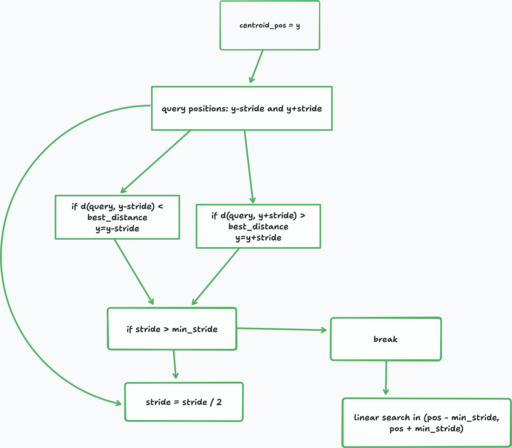
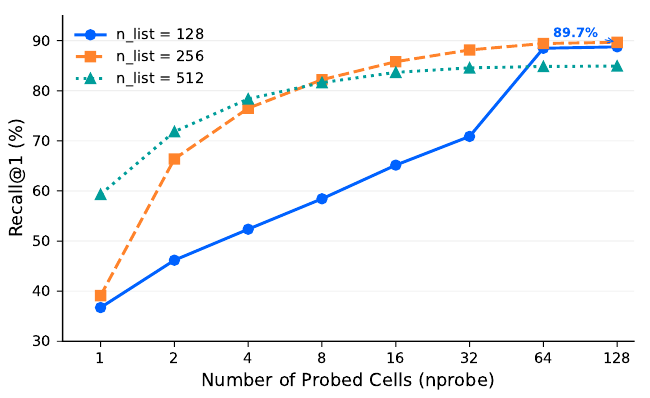
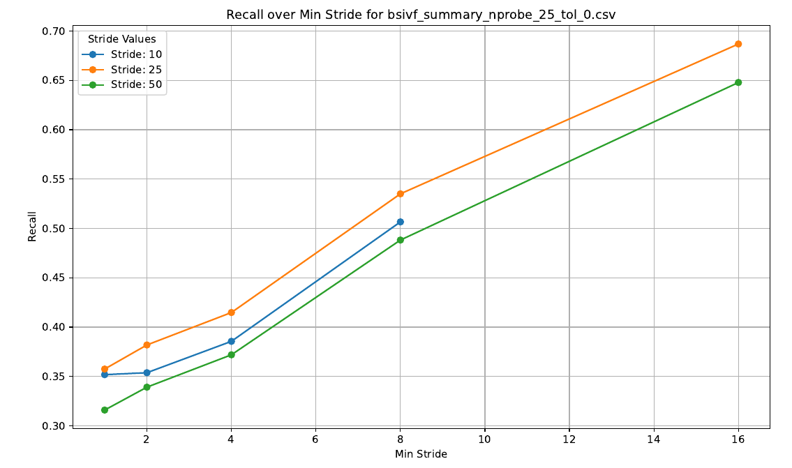
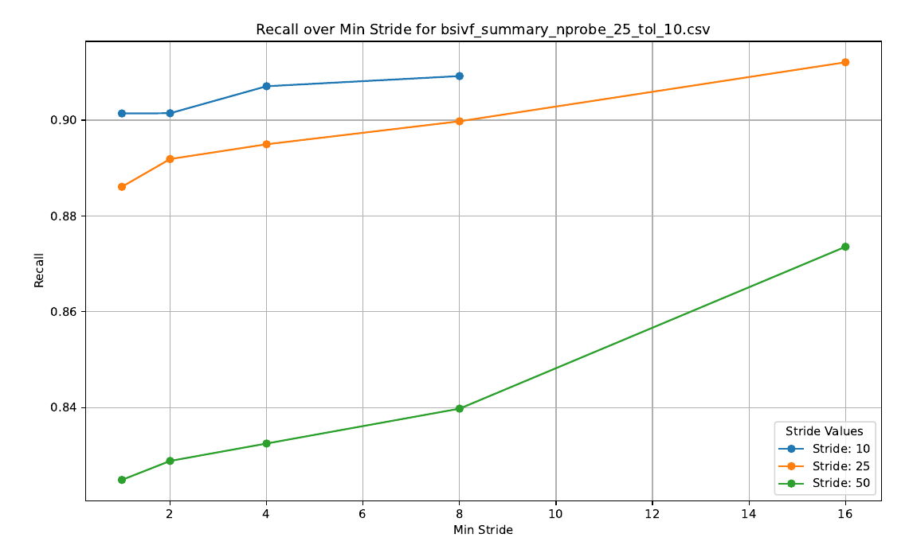
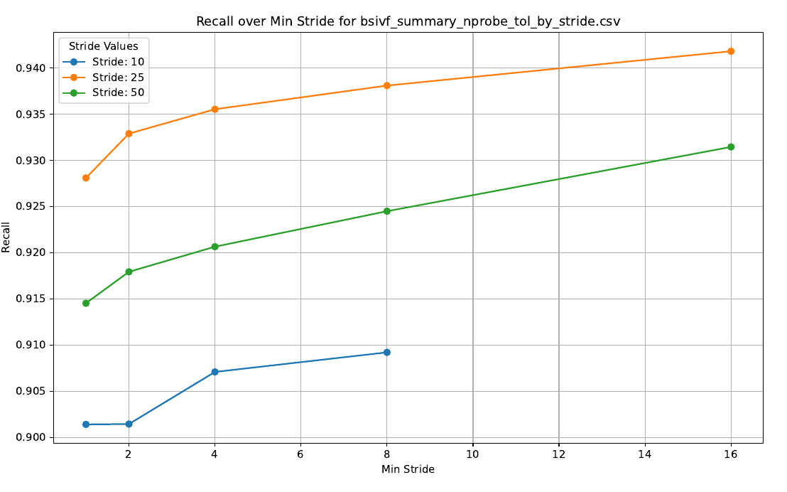

# Genivf 🧬
A domain-specific vector-search library for viral read mapping.

In the past decades, the problem of read mapping in genomics has been posed as string alignment problems with the invention of tools like BLAST, BWA-MEM, Bowtie, etc.
But these tools are based on the _seed_ and _extend_ methods which tends to lose sensitivity when used for a divergent sequence, and virus are very notorious for exhibiting this property.
We presented the problem of read mapping as a vector search problem and this library is a result of our work and two different Approximate Nearest Neighbour search indexes were implemented:
- Inverted file index (IVF), and
- Binary Stride IVF

> **Note** String alignment tools are already established and efficient, this particular work is a proof of concept to show that ANN can be used for read mapping.
> 

## Inverted File Index
The IVF implementation is based on the [FAISS](https://arxiv.org/abs/2401.08281).
That is the search space if firstly divided into `num_cells` number of voronoi cells with kmeans clustering algorithm, with each of the cells having a representative vector called _centroid_.
Then the query vector is compared with the centroids and search is perform exhaustively on the top `nprobe` number of cells.

> **Note** `num_cells` and `nprobe` are part of the parameter used in this library
>
 
### Example
```c++
// initialising a new ivf index
auto index_ivf = genivf::IndexIVF ivf{
    4,// number of cells
    16,// dimension of vectors
    42,// random number seeds for kmeans training
    };

auto points = std::vector<genivf::Point> { ... } // data points

// train into clusters using kmeans
index_ivf.train(
    points, // data points
    100, // max iteration for training
    1e-6 // training convergence epsilon
    );

// add your data points to the index
index_ivf.add(points);

// save your index
genivf::io::save_index(index_ivf, "hello.givf");

// query data 
genivf::Point query = { ... };

// query the database
auto result = index_ivf.search(
    query, 
    1, // k for top-k search
    2, // nprobe
    )
```

## Binary Stride IVF (BSIVF)

This is a custom index based on the IVF, but it works in a different way.
The search space is projected onto a 1D space, and centroids are selected based on `stride`, say for example if you have $10,000$ data points and a `stride` value of 25, then you will have $\frac{10,000}{25} = 400$ centroids.
Then binary search is performed around each centroid as shown below:


> **NOTE** 
> 
> One of the limitations to this method is the assumption of order by hamming distance on the datapoints which implies a high probability of missing out on closer candidates.
> A better indexing structure is planned for future work :)
>

### Example
```c++
auto points = std::vector<genivf::Point> { ... } // data points

IndexBSIVF bsivf(
    points[0].values.size(), // dimension of the vector space 
    points.size() // total number of datapoints
    );

bsivf.construct_centroids(stride);
bsivf.add(data_points);
// query data 
genivf::Point query = { ... };

// query the database
auto result = bsivf.search(query, stride, min_stride, nprobe, metric);
```

For more illustration on usage, checkout the `examples` directory.

## Metrics
The two indexes were tested on the Dengue virus type 1 with 25,000 simulated reads, and the recall@1 results are shown below:

#### IVF


### BSIVF
Since BSIVF is our new custom index we introduced a threshold/tolerance value for calculating the recall@1, i.e. how many results falls at the tolerance distance from the ground truth.


recall with tolerance of 0.

recall with tolerance of 10

recall with tolerance by `stride` value.

## Miscellaneous
In addition to the two indexes, additional helper libraries were add `genivf::seq` for processing fasta and fastq files and `genivf::io` for doing IO tasks, like serialising the index, etc.

## Contributing

Contributions are highly welcomed.

## TODOs
-[ ] implement simd for hamming distance
-[ ] implement hybrid index for ivf-bsivf
-[ ] add more experiments to the example
-[ ] investigate on more viral datasets
-[ ] make the implementation multithreaded
-[ ] improve codebase and add more doc comments
-[ ] python bindings with nanobind
-[ ] rewrite in rust (just kidding 😆)

## Author and Maintainer
Abdulrasheed Fawole (0xfc2f)